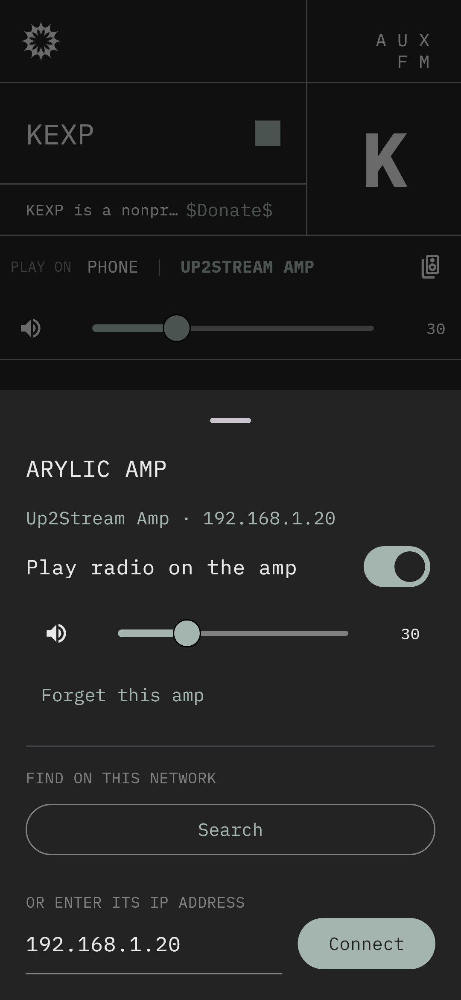

# AUX FM — Android & iOS

Native mobile version of [fm.aux.eco](https://fm.aux.eco), built with
[Flutter](https://flutter.dev). One Dart codebase compiles to native ARM code
for Android (first target) and iOS. There's no WebView.

It can play the radio on the phone, or send it to an
[Arylic](https://www.arylic.com/) streaming amp (Up2Stream Amp, Up2Stream
Pro, A50 and other LinkPlay-based devices) on your Wi-Fi and control it from
the app.

 

## Stack

| Concern | Choice |
| --- | --- |
| UI | Flutter (Material, custom-styled to match the web app) |
| Phone playback | [`just_audio`](https://pub.dev/packages/just_audio): ExoPlayer on Android, AVPlayer on iOS |
| Background play, notification, lock screen, headset buttons | [`audio_service`](https://pub.dev/packages/audio_service) |
| Amp control | Arylic / LinkPlay HTTP API (`lib/arylic/`), no SDK needed |
| Amp discovery | SSDP (UPnP) search, then each responder is confirmed with `getStatusEx` |
| Settings | `shared_preferences` (last station, amp IP, output, theme) |

## Project layout

```
lib/
  main.dart                    app entry, starts the audio service
  data/stations.dart           station list (keep in sync with src/lib/stationlist.ts)
  audio/radio_audio_handler.dart  phone playback + media session
  arylic/arylic_client.dart    Arylic HTTP API client
  arylic/arylic_discovery.dart find amps on the LAN
  controller/radio_controller.dart  app state; routes playback to phone or amp
  ui/                          screens
test/                          unit + widget tests (fake amp, fake player)
```

## Using the amp

1. Put the phone on the same Wi-Fi as the amp.
2. Tap **+ CONNECT AMP**, then **Search**, or type the amp's IP address
   (shown in the Arylic app under device info).
3. With **PLAY ON → <your amp>** selected, tapping a station makes the amp
   fetch and play the stream itself. The phone is only a remote, so you can
   lock it or leave the house without the music stopping.
   Stop/play and volume control the amp. Switching back to **PHONE** moves
   playback to the phone.

Under the hood these are plain HTTP calls, so you can test your amp from a
laptop:

```bash
curl "http://AMP_IP/httpapi.asp?command=getStatusEx"
curl "http://AMP_IP/httpapi.asp?command=setPlayerCmd:play:https%3A%2F%2Fstream-relay-geo.ntslive.net%2Fstream"
curl "http://AMP_IP/httpapi.asp?command=getPlayerStatus"
curl "http://AMP_IP/httpapi.asp?command=setPlayerCmd:vol:30"
curl "http://AMP_IP/httpapi.asp?command=setPlayerCmd:stop"
```

## Development

Install Flutter (stable) and Android Studio (for the Android SDK), then:

```bash
cd mobile
flutter pub get
flutter run            # on a connected phone or emulator
flutter test           # unit + widget tests
flutter build apk      # build/app/outputs/flutter-apk/app-release.apk
```

CI (`.github/workflows/mobile.yml`) runs format, analyze and tests and builds
an APK on every change under `mobile/`. Download the APK from the workflow
run's artifacts to sideload it.

### Before publishing

- **Play Store:** release builds are currently signed with the debug key.
  Create an upload keystore and configure `signingConfigs` in
  `android/app/build.gradle.kts`.
- **iOS:** set your team and bundle ID in Xcode (`ios/Runner.xcworkspace`).
  Network search for the amp needs Apple's multicast entitlement
  (`com.apple.developer.networking.multicast`, requested from Apple). Until
  then, connect by IP address on iOS.

## Notes / limits

- The amp fetches the stream URL itself, so a station has to be playable by
  the amp's firmware (MP3/AAC over http or https).
- If an amp's firmware only answers over HTTPS (some newer LinkPlay
  versions), the client falls back to HTTPS and accepts the amp's
  self-signed certificate for that host only.
