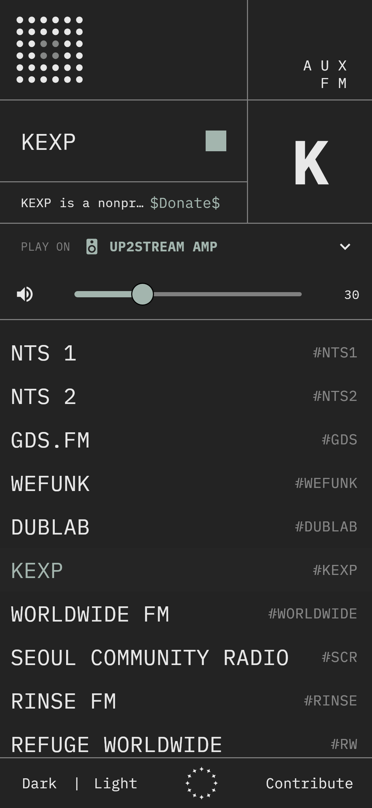
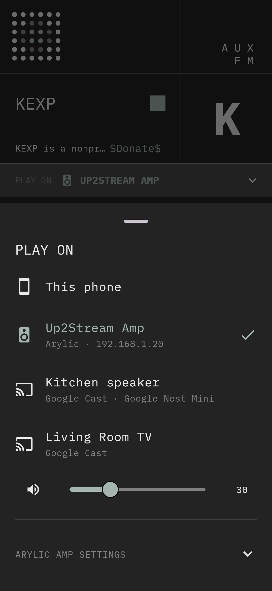

# AUX FM — Android & iOS

Native mobile version of [fm.aux.eco](https://fm.aux.eco), built with
[Flutter](https://flutter.dev). One Dart codebase compiles to native ARM code
for Android (first target) and iOS. There's no WebView.

It plays the radio on the phone, or sends it to a speaker on your Wi-Fi
and controls it from the app:

- an [Arylic](https://www.arylic.com/) streaming amp (Up2Stream Amp,
  Up2Stream Pro, A50 and other LinkPlay-based devices)
- Google Nest / Home speakers, Chromecasts and speaker groups (Google Cast)

It also works as a regular Android media app: lock screen and headset
controls, "Hey Google, play NTS on AUX FM", and Android Auto.

 

## Install on Android

**[Download the latest build](https://github.com/auxeco/fm.aux.eco/actions/workflows/mobile.yml?query=is%3Asuccess)**: open the newest run at the top
and tap **aux-fm-android** under *Artifacts* (you need to be signed in to
GitHub). Every commit that changes the app also gets a comment with a direct
link to its APK.

1. On the phone, open the link above in the browser (not the GitHub app;
   switch to "Desktop site" if *Artifacts* doesn't show) and download
   `aux-fm-android.zip`.
2. In the **Files** app, open the zip and **Extract** it.
3. Tap `app-release.apk`, allow installs from this source when asked, then
   **Install**. If Play Protect warns about an unrecognized app, choose
   **More details → Install anyway**.

Alternatively, unzip it on a computer and install it over USB with
`adb install app-release.apk` (USB debugging enabled on the phone).

Each build is numbered `1.0.<build>`. The number is in the commit comment,
at the bottom of the station list, and under Settings → Apps → AUX FM.

Builds are currently signed with a throwaway key per build, so uninstall the
old version before installing a newer one.

## Stack

| Concern | Choice |
| --- | --- |
| UI | Flutter (Material, custom-styled to match the web app) |
| Phone playback | [`just_audio`](https://pub.dev/packages/just_audio): ExoPlayer on Android, AVPlayer on iOS |
| Background play, notification, lock screen, headset buttons | [`audio_service`](https://pub.dev/packages/audio_service) |
| Amp control | Arylic / LinkPlay HTTP API (`lib/arylic/`), no SDK needed |
| Amp discovery | SSDP (UPnP) search, then each responder is confirmed with `getStatusEx` |
| Google Cast | Cast v2 protocol in Dart (`lib/cast/`): TLS + protobuf framing, Google's Default Media Receiver. No Play services needed |
| Cast discovery | mDNS `_googlecast._tcp` via [`bonsoir`](https://pub.dev/packages/bonsoir) (NsdManager / Bonjour) |
| Voice, Android Auto | `audio_service` media browser: station list, play-from-search, play-from-id |
| Car detection | local plugin `packages/car_connection` (AndroidX `CarConnection`) |
| Settings | `shared_preferences` (last station, amp IP, output, theme) |

## Project layout

```
lib/
  main.dart                    app entry, starts the audio service
  data/stations.dart           station list (keep in sync with src/lib/stationlist.ts)
  audio/radio_audio_handler.dart  phone playback + media session
  arylic/arylic_client.dart    Arylic HTTP API client
  arylic/arylic_discovery.dart find amps on the LAN
  cast/                        Google Cast client + mDNS discovery
  speakers/remote_speaker.dart one interface over Arylic and Cast speakers
  voice/station_search.dart    matches "NTS two", "dub lab", ... to stations
  controller/radio_controller.dart  app state; routes playback to a speaker
  ui/                          screens
packages/car_connection/       tiny Android plugin: is Android Auto connected?
test/                          unit + widget tests (fake amp, fake Cast
                               device speaking the real protocol, fake player)
```

## Speakers

Tap **PLAY ON** to choose where the radio plays. Whatever is playing moves
to the speaker you pick. On a network speaker, the speaker fetches the
stream itself and the phone is only a remote: you can lock it or leave the
house and the music keeps going. Play/stop, station changes and volume
control the selected speaker.

**Arylic amp:** open **PLAY ON → Connect an Arylic amp**, tap **Search
this network** or type the amp's IP address (shown in the Arylic app under
device info). The amp is remembered.

**Google Nest / Chromecast:** these show up in the list automatically when
the phone is on the same Wi-Fi. Speaker groups from the Google Home app show
up too.

Under the hood these are plain HTTP calls, so you can test your amp from a
laptop:

```bash
curl "http://AMP_IP/httpapi.asp?command=getStatusEx"
curl "http://AMP_IP/httpapi.asp?command=setPlayerCmd:play:https%3A%2F%2Fstream-relay-geo.ntslive.net%2Fstream"
curl "http://AMP_IP/httpapi.asp?command=getPlayerStatus"
curl "http://AMP_IP/httpapi.asp?command=setPlayerCmd:vol:30"
curl "http://AMP_IP/httpapi.asp?command=setPlayerCmd:stop"
```

## Voice and Android Auto

The app publishes its station list through Android's media browser, so:

- **Voice:** "Hey Google, play KEXP on AUX FM" starts KEXP on whichever
  speaker is selected (phone, amp or Nest). Spoken names are matched loosely
  ("NTS two", "dub lab", "Buena Vida"). Whether this works depends on the
  phone's assistant: Google Assistant supports it, and Gemini's support for
  third-party media apps varies by device and region.
- **Android Auto:** AUX FM appears as a media app with all stations. When
  the phone is connected to a car, playback always stays on the phone, even
  if the amp or a Nest speaker was selected; the speaker at home is left
  alone.
- Headset buttons, the lock screen and the notification work as usual.

Android Auto only lists apps installed from the Play Store. To test a
sideloaded APK, open Android Auto settings, tap the version number repeatedly
to enable developer mode, then enable **Unknown sources** in its developer
settings.

## Development

Install Flutter (stable) and Android Studio (for the Android SDK), then:

```bash
cd mobile
flutter pub get
flutter run            # on a connected phone or emulator
flutter test           # unit + widget tests
flutter build apk      # build/app/outputs/flutter-apk/app-release.apk
```

CI (`.github/workflows/mobile.yml`) runs format, analyze and tests and builds
an APK on every change under `mobile/`. Download the APK from the workflow
run's artifacts to sideload it.

### Before publishing

- **Play Store:** release builds are currently signed with the debug key.
  Create an upload keystore and configure `signingConfigs` in
  `android/app/build.gradle.kts`.
- **iOS:** set your team and bundle ID in Xcode (`ios/Runner.xcworkspace`).
  Network search for the amp needs Apple's multicast entitlement
  (`com.apple.developer.networking.multicast`, requested from Apple). Until
  then, connect by IP address on iOS. Google Cast discovery uses Bonjour and
  works without it. Car detection is Android-only so far (CarPlay would need
  its own work).

## Notes / limits

- The amp fetches the stream URL itself, so a station has to be playable by
  the amp's firmware (MP3/AAC over http or https).
- Casting uses Google's Default Media Receiver, so Nest speakers show the
  station name and the AUX FM icon, not the live track title.
- If an amp's firmware only answers over HTTPS (some newer LinkPlay
  versions), the client falls back to HTTPS and accepts the amp's
  self-signed certificate for that host only.
